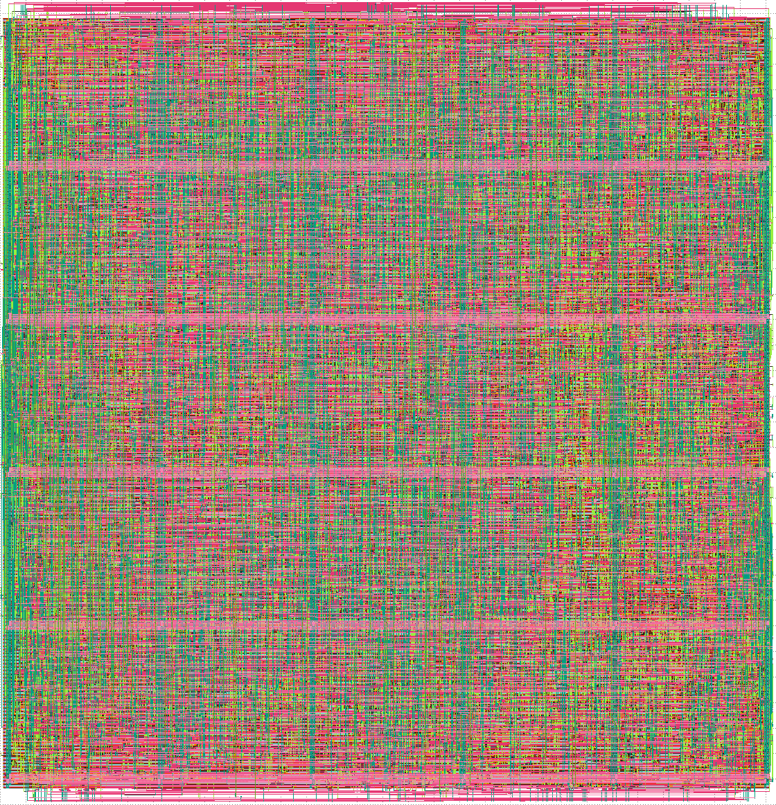

# vlsi-arithmetic

Create fast and efficient standard cell based adders, multipliers and
multiply-adders.

[](https://github.com/antonblanchard/vlsi-arithmetic/actions/workflows/test.yml)
[](https://opensource.org/licenses/Apache-2.0)
[](http://makeapullrequest.com)

# Features

## Fast
A 2 cycle 64 bit multiply-adder (`64bit * 64bit + 128bit -> 128bit`) built with
the [OpenROAD](https://github.com/The-OpenROAD-Project/OpenROAD) RTL to GDSII
flow and the [ASAP7](https://github.com/The-OpenROAD-Project/asap7) 7nm
academic PDK makes timing at 1.85 GHz [^1]. It takes up 3600um of area:



A 4 cycle 32 bit multiplier (`32bit * 32bit -> 64bit`), also using OpenROAD and
ASAP7 makes timing at 2.7 GHz [^1]. Both cases are likely to improve as OpenROAD
improves (including better timing aware global placement and global routing,
improvements to the resizer, improvements to clock tree synthesis and the use of
LVT cells).

vlsi-arithmetic achieves this by using many well established techniques
including
[Booth encoding](https://en.wikipedia.org/wiki/Booth%27s_multiplication_algorithm),
[Dadda reduction](https://en.wikipedia.org/wiki/Dadda_multiplier) and a choice
of fast adders like
[Kogge-Stone](https://en.wikipedia.org/wiki/Kogge%E2%80%93Stone_adder).

For more details about these algorithms, check out this
[Twitter thread](https://twitter.com/antonblanchard/status/1540286905379524611)
which details the implementation of the multiplier in the
[Bluegene Q](https://en.wikipedia.org/wiki/IBM_Blue_Gene) supercomputer.

## Configurable

vlsi-arithmetic is written in the
[Amaranth](https://github.com/amaranth-lang/amaranth) HDL language which allows
it to be very configurable, including:

- Configurable number of bits

  Any power of two likely works, although Amaranth does start to slow down when
  building 64 bit multipliers due to a polynomial time complexity issue when
  adding signals. An
  [issue](https://github.com/amaranth-lang/amaranth/issues/711) has been opened
  to track this and once fixed larger multipliers should be possible.

- Choice of algorithms

  Various addition algorithms are supported:
  - [Brent-Kung](https://en.wikipedia.org/wiki/Brent%E2%80%93Kung_adder)
    (less area, lower performance)
  - [Kogge-Stone](https://en.wikipedia.org/wiki/Kogge%E2%80%93Stone_adder)
    (more area, higher performance)
  - Han-Carlson (a balance of area and performance)

- Configurable number of stages

  Configurable number of stages, from purely combinational, to 4 register
  stages. All configurations are fully pipelined. Trade latency for frequency.

## Formally verified

[Yosys](https://github.com/YosysHQ/yosys) is used to formally verify the
standard cell implementation matches gold behavioural models. Amaranth unit
tests and [Verilator](https://www.veripool.org/verilator/) based tests are also
used to further verify the design.

## Support for many technologies.

vlsi-arithmetic currently supports the
[SkyWater sky130hd](https://github.com/google/skywater-pdk),
[GlobalFoundries GF180MCU](https://github.com/google/gf180mcu-pdk) and
[ASAP7](https://github.com/The-OpenROAD-Project/asap7) PDKs and standard cell
libraries.

## Easy to add support for new technologies
vlsi-arithmetic only requires a few standard cells (full and half adders,
2 input xor, 2 input and, inverter as well as a couple of more complicated
cells (ao21, ao22, ao33)

# Installation

vlsi-multiplier is a python package, so this will install it and any
dependencies:

```
pip install git+https://github.com/antonblanchard/vlsi-arithmetic
```

Another option is to install it from a checked out source tree:
```
pip install .
```

Amaranth requires Yosys. If you don't have a version installed, you can use the
amaranth-yosys package:

```
pip3 install amaranth-yosys
```

# Example usage

Create a GF180MCU 64 bit Kogge-Stone adder:

```
vlsi-adder --bits=64 --algorithm=koggestone --tech=gf180mcu --output=adder.v
```

Create an ASAP7 32 bit multiplier, using a Brent-Kung adder:

```
vlsi-multiplier --bits=32 --algorithm=brentkung --tech=asap7 --output=multiplier.v
```

Create a sky130hd 2 cycle 64 bit multiply-adder, which was taped out in the
OpenPOWER [Microwatt](https://github.com/antonblanchard/microwatt) core for the
Google/Efabless/SkyWater MPW7 shuttle (one for the fixed point multiplier and
another for the floating point multiplier):

```
vlsi-multiplier --bits=64 --multiply-add --algorithm=hancarlson --tech=sky130hd --register-post-ppg --output=multiply_adder_pipelined.v
```

# Testing
Local testing requires an installation of both yosys and verilator. Run
`make check`.  Submitting a pull request will kick off the same set of tests.

# Adding a new technology

Using ASAP7 as an example:

- A [technology file](vlsi_arithmetic/tech/asap7.py) that contains code to
  instantiate the standard cells required. Use one of the existing ones as a
  starting point.

  When creating instances, Amaranth uses the i_* prefix for inputs and the o_*
  prefix for outputs, ie i_VDD means the instance has an input called VDD. As
  an example, this instantiates the XOR2x1_ASAP7_75t_R xor cell that has A and
  B inputs and a Y output.

  Also note that ASAP7 inverts the outputs of the full and half adders, so you
  will see inverters in this file to undo this. Remove them if your technology
  has non inverting outputs.

```
      def _generate_xor(self, a, b, o):
        xorgate = self._PoweredInstance(
            "XOR2x1_ASAP7_75t_R",
            i_A=a,
            i_B=b,
            o_Y=o
        )

        self.m.submodules += xorgate
```

- Modify [get_tech()](vlsi_arithmetic/tech/Tech.py) to hook the new tech up.

- [Verilog behavioural models](verilog/asap7.v) for the standard cells, used
  for verification.

- Finally add the new technology to the CI [here](ci/formal.sh) and
  [here](ci/verilator.sh).

# Issues

- No support for signed multipliers. Planning to add this.

- No support for carry in or carry out of adders. Planning to add this.

- No support for clock gating yet.

- Formal verification of multipliers is slow, and gets unbearably slow as
  the multiplier reaches 64 bits. As a result, we formally verify smaller
  configurations only. We should check if we there are faster equivalence
  checking methods in Yosys. Another idea might be to verify each output
  bit in a different Yosys process, parallelising things.

- Adding more optional register stages. Splitting Dadda reduction into two
  cycles and perhaps final addition into two cycles would improve the
  multiplier frequency.

- We use OpenROAD for cell placement. We might be able to improve the area of
  the design by doing manual placement, but it's not clear the effort is worth
  it. We currently use Yosys to instantiate FFs, so we'd need to do this before
  attempting manual placement.

- Support for 4:2 compressors (basically 2 full adders). This is what
  Bluegene Q uses and might help to improve area and frequency a bit. We'd
  need to create a 4:2 compressor cell since none of the standard cell
  libraries vlsi-arithmetic support contain one.

[^1]: ASAP7 RVT cells, STA at best corner, 50 ps reserved in the first and
second cycles for input and output logic/routing outside the macro.
